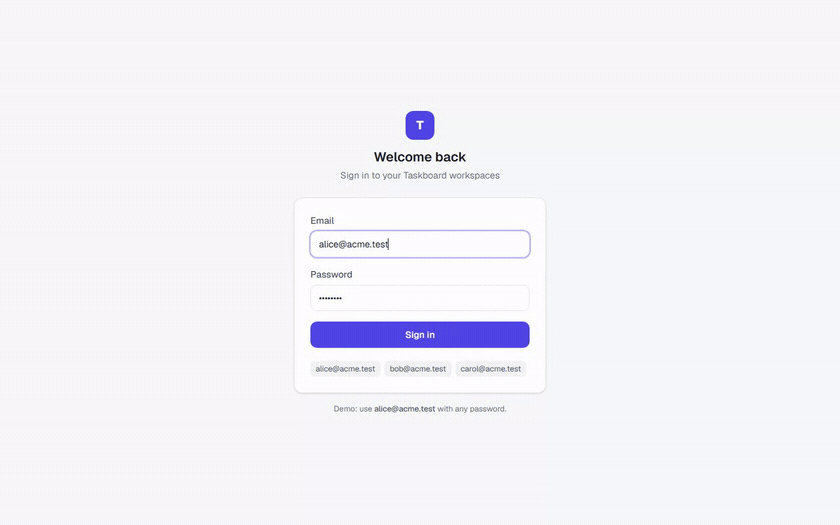
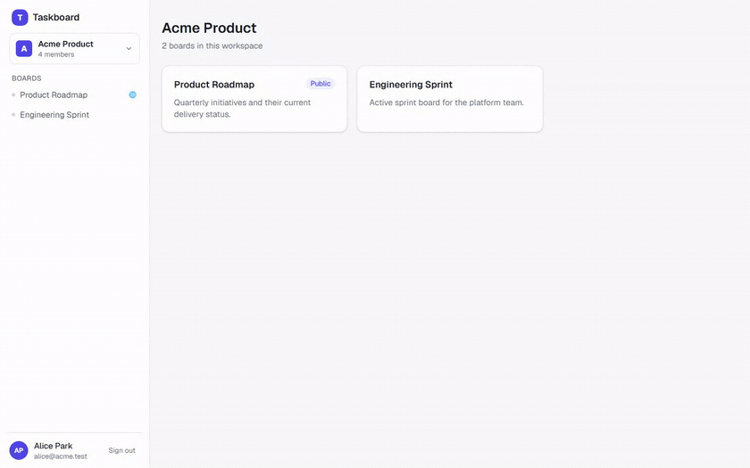
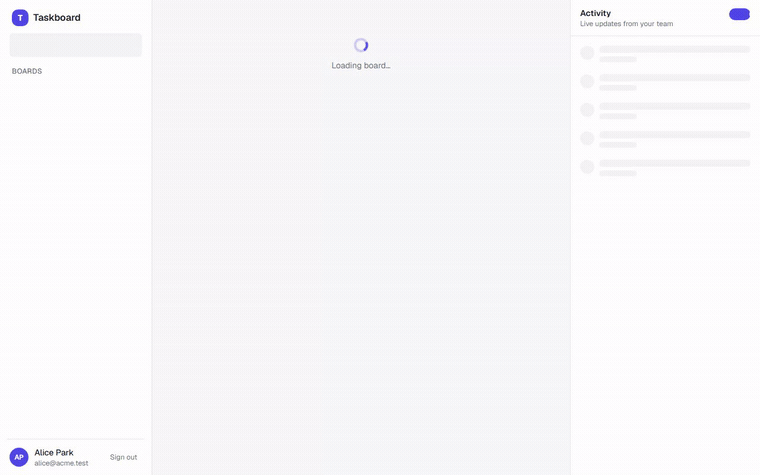
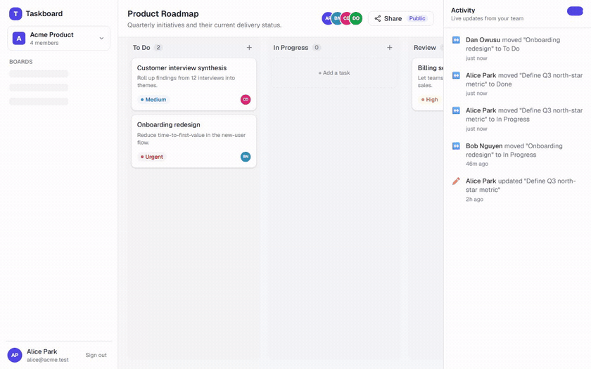
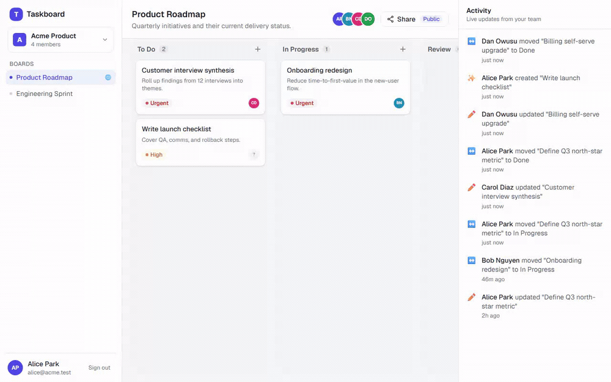
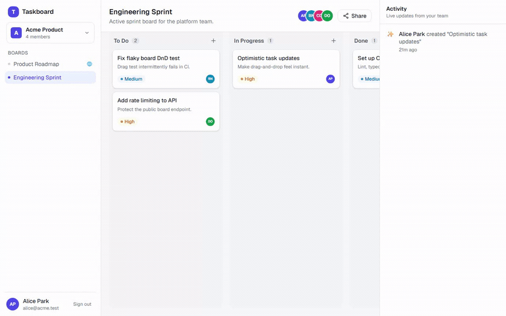

# Taskboard — Multi-Workspace Task Board with Shareable Views

A SaaS-style frontend where teams manage work across multiple **workspaces**, each
containing **boards** (Board → Columns → Tasks). Authenticated areas sit behind a
mock login; selected boards can be published as **public, crawlable, shareable**
pages. Built as an integrated **Next.js (React) + Node** app.

### 🔗 Live demo

**App:** https://taskboard-workspace-portal.onrender.com
&nbsp;·&nbsp; sign in with `alice@acme.test` and any password.

**Public shareable board (no login):**
https://taskboard-workspace-portal.onrender.com/public/board/b-roadmap

> Hosted on Render's free tier — the first request after idle may cold-start
> (~30–60s), and the in-memory demo data resets on restart (there's no database).

> Engineering write-up (architecture, trade-offs, decisions) lives in
> [`ENGINEERING_NOTES.md`](./ENGINEERING_NOTES.md) — with demo GIFs of each feature.

---

## Tech stack

| Concern | Choice | Why |
| --- | --- | --- |
| Framework | **Next.js 16 (App Router) + TypeScript** | React UI + Node API in one app; SSR for public/shareable pages |
| Styling | **Tailwind CSS v4** | Token-driven, consistent spacing/typography |
| Server state | **TanStack Query** | Caching, optimistic updates, polling |
| Client state | **Zustand** | Workspace selection, toasts |
| Drag & drop | **@dnd-kit** | Accessible move/reorder |
| Validation | **zod** | Request validation shared with inferred types |
| Mock API | **Next Route Handlers** + in-memory store | Real server routes; enables true SSR of public boards |

## Requirements

- **Node.js 20+** and npm.

## Run locally

```bash
npm install
npm run dev
# open http://localhost:3000
```

Other scripts:

```bash
npm run build   # production build (type-checked)
npm run start   # serve the production build
npm run lint    # eslint
```

## Deploy (Render)

Deploys as a **Node web service** (it needs a running server for SSR, the API
routes, and the in-memory store — not a static site). A [`render.yaml`](./render.yaml)
blueprint is included.

1. On Render: **New → Blueprint**, connect this repo (or **New → Web Service** and
   copy the settings from `render.yaml`).
2. Build: `npm ci && npm run build` · Start: `npx next start -p $PORT` ·
   Health check: `/api/health`.
3. Deploy. No env vars are required — the app auto-detects its public URL from
   Render's `RENDER_EXTERNAL_URL` (used for canonical/OG/sitemap links). Set
   `NEXT_PUBLIC_SITE_URL` only for a custom domain.

**Important:** run a **single instance**. The mock backend holds state in memory
and runs a background simulator interval; neither is shared across instances.
On the free plan the service spins down when idle, so the in-memory data resets
on cold start (expected — there's no database).

### Demo login

Authentication is mocked: **any seeded email with any non-empty password** works.

| Email | Workspaces |
| --- | --- |
| `alice@acme.test` | Acme Product, Launch Team |
| `bob@acme.test` | Acme Product |
| `carol@acme.test` | Acme Product, Launch Team |

The login screen has one-click chips to fill these in.

---

## What to try

1. **Sign in** → land on the workspace home listing its boards.
2. **Switch workspaces** from the sidebar switcher — the board list follows context
   (your selection persists across refreshes).
3. **Open a board** → drag tasks across columns and reorder within a column. Updates
   are **optimistic** (instant) and reconcile with the server.
4. **Create / edit / delete** tasks via the task dialog.
5. **Watch the activity feed** — a server-side simulator mimics teammates; changes
   stream in via polling, with a toast when someone else makes a change. Use the
   **toggle in the activity rail header** to pause/resume the simulated activity.
6. **Share a board**: toggle it public and copy the link. Open
   `/public/board/<id>` in an incognito window — it renders **without auth**, with
   real SSR HTML, Open Graph/Twitter meta, a generated preview image, and JSON-LD.
   Also see `/sitemap.xml` and `/robots.txt`.
7. **Session expiry**: sessions are short-lived; expiry is handled gracefully
   (toast + redirect to login). You can force it via `POST /api/session/expire`.

---

## Requirements coverage

Every requirement from the assignment spec, and how it's met. Deeper rationale is in
[`ENGINEERING_NOTES.md`](./ENGINEERING_NOTES.md).

### 1. Authentication & Session Handling ✅



- **Basic login via mock API** — `POST /api/login` accepts any seeded email + any
  password and sets an **httpOnly** session cookie.
- **Restricted access to authenticated areas** — two layers: the edge `proxy.ts` gates
  page routes on cookie presence, and the `(app)` server layout authoritatively
  validates the session before rendering. API routes enforce auth and return `401`.
- **Graceful session expiration** — short TTL; any `401` funnels through one global
  handler → toast → redirect to `/login?next=…`. Force it via `POST /api/session/expire`.

### 2. Multi-Workspace Support ✅



- **Belong to multiple workspaces** — seeded users belong to several.
- **View & switch** — sidebar workspace switcher lists all and changes context.
- **Consistent context** — selection lives in one Zustand store (`currentWorkspaceId`,
  persisted to localStorage). Every board/list query derives from it, so context is
  applied uniformly across the app and survives refresh.

### 3. Task Board (core feature) ✅




- **Board → Columns → Tasks** structure, displayed as a horizontally-scrolling board.
- **Move tasks across columns** and **reorder within a column** via @dnd-kit, persisted
  optimistically.
- **Create / edit / delete** tasks through a shared dialog.
- **Task metadata** — title, description, status, priority, assignee (status is derived
  from the column on move).

### 4. Activity / Updates — simulated real-time ✅



- **Updates reflected in the UI** — board + activity poll on intervals (TanStack Query
  `refetchInterval`).
- **Simulated multi-user updates** — a server-side `simulator` periodically moves tasks
  and bumps priorities, logging activity entries. A **toggle in the activity rail**
  turns this live simulation on/off (server-side flag via `PATCH /api/simulation`).
- **Recent activity surfaced meaningfully** — a live activity rail (with relative times
  and actor avatars) plus a toast when *someone else* makes a change.

### 5. Data Fetching & Synchronization ✅

- **Integrates with the mocked APIs** through a single typed `apiClient`.
- **Loading / error / data-consistency states** everywhere — skeletons, retryable error
  states, empty states; consistency via optimistic updates with rollback + query
  invalidation. The mock API injects latency so these states are real.
- **Clean abstraction** — components → hooks → `endpoints` → `apiClient`. UI never calls
  `fetch` directly.

### 6. Publicly Shareable Views ✅



- **No auth required** — `/public/board/[id]` is exempt from the proxy and needs no
  session.
- **Meaningful, structured content** — full **SSR** HTML (view-source shows real tasks),
  not a JS shell.
- **Good when shared externally** — Open Graph + Twitter meta, a generated
  `opengraph-image` preview card, canonical URL.
- **Discoverable / machine-legible** — JSON-LD (`ItemList`) structured data, plus
  `/sitemap.xml` (public boards only) and `/robots.txt`.
- **Direct-navigation safe** — only boards toggled public are served; others `404`.

### 7. Layout & UI System ✅

- **Responsive** — sidebar collapses to a drawer; activity rail becomes a toggle; board
  scrolls horizontally on small screens.
- **Consistent** — a Tailwind **design-token** system (one neutral ramp, one brand
  color, semantic roles) drives spacing, typography, and color.
- **Usability over visual complexity** — deliberately clean, legible surfaces.

---

## Spec design questions, answered

The spec's open-ended "Additional Considerations":

**How do you structure your application for scalability?**
By responsibility, with a one-way dependency flow: `components → hooks → endpoints →
apiClient`, and a swappable backend isolated in `lib/mock`. Route groups separate
public, authenticated, and shareable concerns. Replacing the mock with a real backend
touches only `endpoints.ts` + `lib/mock`; no component changes.

**How do you manage shared vs local state?**
Server/shared data (workspaces, boards, tasks, activity) lives in **TanStack Query**
with hierarchical keys; purely local UI state (current workspace, toasts) lives in
small **Zustand** stores. Server data is never copied into a global client store, which
avoids dual-source-of-truth bugs.

**How do you organize API logic?**
One choke-point. `apiClient` owns transport + error normalization + global 401 handling;
`endpoints.ts` holds typed per-route wrappers (the only module that knows URLs); zod
`schemas` validate payloads and provide inferred types shared by client and server;
`http.ts` standardizes server responses.

**How do you model your data structures?**
`User · Workspace · Board · Column · Task · Activity`, with **explicit ordering**
(`columnOrder`, `taskIds[]`) so move/reorder are deterministic array operations applied
identically on client (optimistic) and server.

**How do you ensure components remain reusable?**
A presentational UI-primitive kit on design tokens, and feature components that separate
concerns — e.g. `TaskCard` is pure and reused in the interactive board, the drag
overlay, and the read-only public view; the drag behavior lives in a separate wrapper.

---

## Optional enhancements implemented

From the spec's optional list:

| Enhancement | Status & how |
| --- | --- |
| **Optimistic updates** | ✅ Drag/drop, task CRUD and share toggle apply instantly with rollback |
| **Offline support** | ✅ Connectivity banner; the board stays usable from cache offline and mutations are **queued and replayed on reconnect** (verified: create offline → reconnect → persists server-side) |
| **Advanced filtering / search** | ✅ Board filter bar: text search + priority + assignee, with a shown/total count |
| **Undo/redo for task actions** | ✅ Per-board command history (move/edit/create/delete) with toolbar buttons and Ctrl/Cmd+Z · Shift+Z |
| **Performance for large datasets** | ✅ A seeded 240-task board; the **activity feed is virtualized** (windowed) and task cards are **memoized** so the big board stays smooth with drag-and-drop intact |
| **Improved shared/public views** | ✅ SSR + OG image + Twitter card + JSON-LD + sitemap/robots + runtime URL detection |
| **Other usability/robustness** | ✅ Activity feed with pause toggle, toasts, graceful session expiry, responsive drawers, full loading/error/empty states |

**A deliberate trade-off:** the interactive board is **not** windowed. Reliably
composing list virtualization with accessible drag-and-drop is fragile, so large
boards use memoization instead (verified smooth at 240 tasks with working DnD),
while virtualization is applied to the activity feed where it's purely
beneficial. The public board is intentionally fully rendered (not virtualized)
so all tasks are present in the crawlable SSR HTML.

---

## Mock API

All under `/api`, backed by an in-memory store seeded on boot (resets on restart).

| Method | Route | Auth | Purpose |
| --- | --- | --- | --- |
| POST | `/api/login` | – | Mock login, sets httpOnly session cookie |
| POST | `/api/logout` | – | Clear session |
| GET | `/api/session` | ✓ | Introspect session |
| POST | `/api/session/expire` | ✓ | Demo helper: force expiry |
| GET | `/api/workspaces` | ✓ | Current user's workspaces |
| GET | `/api/boards?workspaceId=` | ✓ | Boards in a workspace |
| GET | `/api/board/:id` | ✓ | Full board (columns + tasks + members) |
| PATCH | `/api/board/:id/share` | ✓ | Toggle public visibility |
| POST | `/api/task` | ✓ | Create task |
| PATCH | `/api/task/:id` | ✓ | Edit / move / reorder |
| DELETE | `/api/task/:id` | ✓ | Delete task |
| GET | `/api/activity?boardId=` | ✓ | Recent activity (polled) |
| GET/PATCH | `/api/simulation` | ✓ | Read / toggle the live-activity simulator |
| GET | `/api/public/board/:id` | – | Read-only public board (public boards only) |

---

## Project structure

```
src/
  app/
    (auth)/login/            # login screen (public)
    (app)/                   # authenticated shell + pages (workspace home, board)
    public/board/[id]/       # SSR public board + opengraph-image
    api/                     # Node route handlers (mock backend)
    sitemap.ts, robots.ts    # discoverability
  components/
    ui/                      # reusable primitives (Button, Modal, …)
    layout/                  # AppShell, Sidebar, WorkspaceSwitcher
    board/                   # BoardView (dnd), Column, TaskCard, TaskModal, …
    activity/                # ActivityFeed
    public/                  # PublicBoardView (read-only)
    providers/               # QueryProvider, SessionProvider
  hooks/                     # data hooks (useBoard, useWorkspaces, …)
  lib/
    api/                     # apiClient, endpoints, schemas, http helpers
    mock/                    # in-memory db, seed, simulator
    query/                   # query keys + optimistic cache transforms
  store/                     # Zustand stores (workspace, toast)
  types/                     # domain models
  proxy.ts                   # route protection (Next "proxy" convention)
```

See [`ENGINEERING_NOTES.md`](./ENGINEERING_NOTES.md) for the reasoning behind these
choices, trade-offs, and assumptions.
